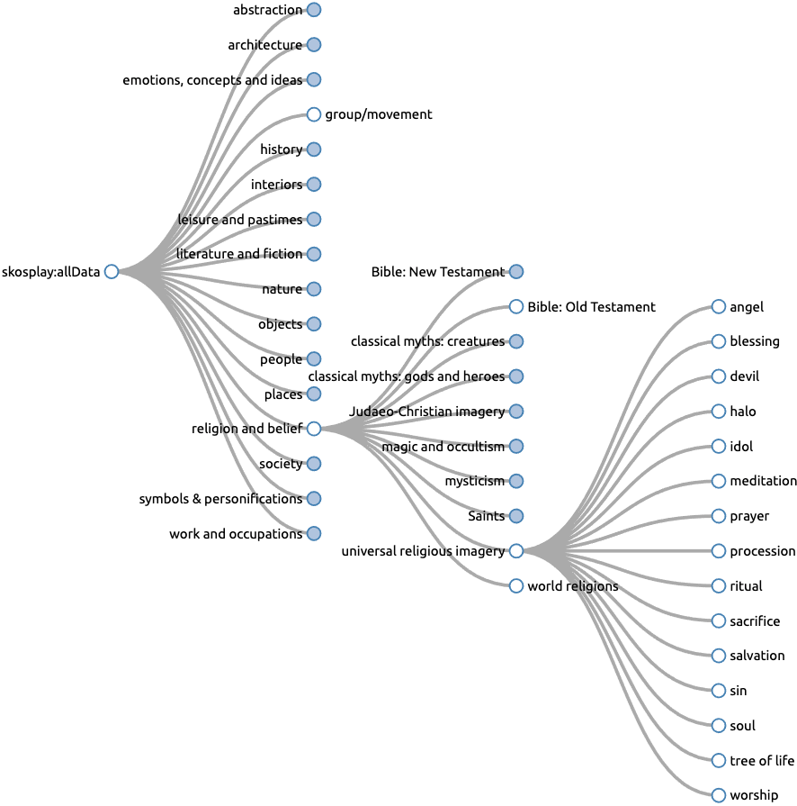

# Tate's Subject Hierarchy as a SKOS Taxonomy
This repository features a [SKOS](https://www.w3.org/2004/02/skos/) taxonomy generated from Tate's subject hierarchy through the use of Catalink's proprietary semantic data integration framework [CASPAR](https://caspar.catalink.eu/). 


## Scope & Aim
[Tate UK](https://www.tate.org.uk/) has publicly released its subject hierarchy as a [set of JSON files](https://github.com/tategallery/collection/tree/master/processed/subjects) organized in three levels. For example, in [this artwork](http://www.tate.org.uk/art/artworks/blake-a-figure-bowing-before-a-seated-old-man-with-his-arm-outstretched-in-benediction-a00001) by Robert Blake, the relevant subjects are found in section 'Explore'. An excerpt from the list of subjects for the specific artwork is `'religion and belief' > 'universal religious imagery' > 'blessing'`. The following table indicates the total number of subjects per level:

|  Level  | Count |
|:-------:|:-----:|
| level-0 |   16  |
| level-1 |  142  |
| level-2 |  2251 |

Having the subject hierarchy in SKOS format enables its easy publication and use by third parties as [linked data](https://en.wikipedia.org/wiki/Linked_data). Thus, in order to establish semantic interoperability with third parties, our aim in this work was to convert the JSON files to a SKOS taxonomy using our in-house [CASPAR framework](https://caspar.catalink.eu/) for semantic data integration.


## Semantic Data Integration with CASPAR
CASPAR converts the input files into a semantic [Knowledge Graph](https://en.wikipedia.org/wiki/Knowledge_graph) (KG) - in this case an RDF SKOS taxonomy - through the definition of mappings between input data fields and respective ontology concepts. The specification of mappings is compliant with a proprietary Domain-Specific Language (DSL) based on JSON syntax.

Just for reference, the mappings for converting Tate's JSON files into a SKOS taxonomy via CASPAR are found [here](resources/mappings).


## SKOS Taxonomy
The resulting SKOS taxonomy can be found [here](tate-skos.ttl) and its namespace is `http://w3id.org/tate-skos#`. 

Through [SKOS Play](https://skos-play.sparna.fr/play/) we generated the subject tree (see figure below), as well as the [complete documentation](resources/documentation/tate-skos-documentation.pdf) (PDF file), containing the alphabetical index of the subjects with attributes on each entry (notation, broader, narrower, related, all notes), followed by a clickable hierarchical tree that directs to entries in the alphabetical index.




## Sample SPARQL Queries

Below is a list of indicative SPARQL queries for retrieving information from the KG.

### List All Level-0 Concepts
```sparql
PREFIX rdf: <http://www.w3.org/1999/02/22-rdf-syntax-ns#>
PREFIX skos: <http://www.w3.org/2004/02/skos/core#>

SELECT DISTINCT ?level_0_concept
WHERE {
    ?level_0_concept rdf:type skos:Concept .
    MINUS {
        ?other_concept rdf:type skos:Concept .
        ?level_0_concept skos:broader ?other_concept .
    }
} 
```

### List All Level-1 Concepts
```sparql
PREFIX rdf: <http://www.w3.org/1999/02/22-rdf-syntax-ns#>
PREFIX skos: <http://www.w3.org/2004/02/skos/core#>

SELECT DISTINCT ?level_1_concept
WHERE {
    ?level_1_concept rdf:type skos:Concept .    
    ?level_1_concept skos:broader ?level_0_concept .
    MINUS {
        ?other_concept rdf:type skos:Concept .
        ?level_0_concept skos:broader ?other_concept .
    }    
} 
```

### List All Level-2 Concepts
```sparql
PREFIX rdf: <http://www.w3.org/1999/02/22-rdf-syntax-ns#>
PREFIX skos: <http://www.w3.org/2004/02/skos/core#>

SELECT DISTINCT ?level_2_concept
WHERE { 
	?level_2_concept rdf:type skos:Concept .
    ?level_2_concept skos:broader ?level_1_concept . 
    ?level_1_concept skos:broader ?level_0_concept .
} 
```


## Contact Details
For any queries or remarks on the Tate SKOS taxonomy, or if you would like to deploy CASPAR for your use case, please feel free to [contact us](mailto:caspar@catalink.eu?subject=Tate%20SKOS).